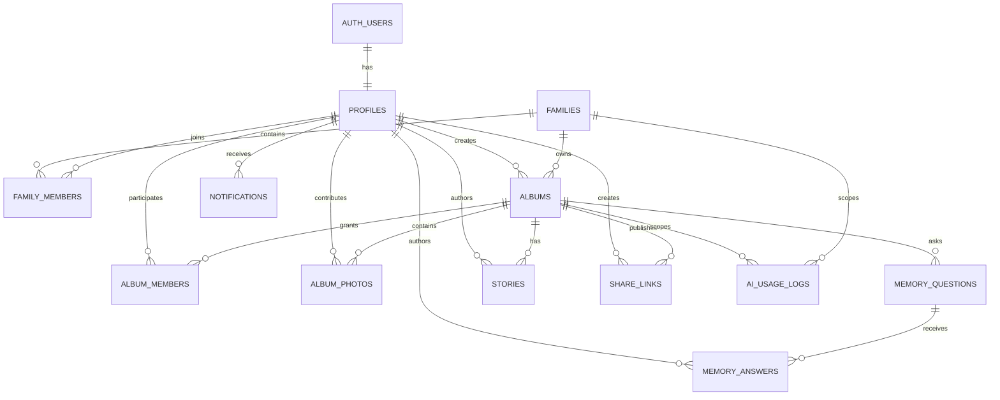

# Momento 가족 AI 기억 플랫폼 — 데이터베이스 설계 및 점진적 마이그레이션 계획

> 상태: 설계안 (DB/Storage/애플리케이션 변경 및 SQL 실행 없음)  
> 작성일: 2026-07-12  
> 분석 기준: 저장소의 `supabase/schema.sql`, FastAPI/React 코드. 운영 Supabase에 대시보드로 수동 적용한 스키마·정책은 이 저장소만으로 검증할 수 없으므로, 실제 마이그레이션 전 반드시 카탈로그/정책/버킷을 대조한다.

## 1. 현재 구조 요약

### 인프라와 인증

| 영역 | 현재 구현 | 근거 |
| --- | --- | --- |
| DB | Supabase Postgres, `public.albums` 1개 테이블 | `supabase/schema.sql` |
| Storage | `albums` 버킷, **public=true** | `supabase/schema.sql`, `backend/app/config.py` |
| 서버 DB 접근 | FastAPI가 `SUPABASE_SERVICE_ROLE_KEY`로 Supabase client 생성. 서비스 역할은 RLS를 우회한다. | `backend/app/services/supabase.py` |
| 서버 인증 | 보호 API는 Bearer token을 받아 `auth.get_user(token)`으로 Supabase Auth 사용자를 검증하고 UUID만 반환 | `backend/app/services/auth.py` |
| 브라우저 인증 | Supabase JS client, 로그인 UI, 세션 저장/토큰 주입 코드가 없다. 현재 업로드·수정 요청도 `Authorization` 헤더를 보내지 않는다. | `frontend/src/components/UploadForm.tsx`, `frontend/src/lib/api.ts` |
| AI | OpenAI로 사진별 이야기에서 앨범 narrative 생성 | `backend/app/services/openai_service.py` |

### 현재 `albums` 데이터 모델

`public.albums`는 앨범, 사진 목록, 사진별 이야기, 생성 결과를 한 행에 함께 넣는다.

| 컬럼 | 타입 | 용도 |
| --- | --- | --- |
| `id` | `uuid` | 앨범 PK. 서버에서 UUID 생성 |
| `owner_id` | `uuid`, `auth.users(id)` FK | 생성자의 Auth user ID. `ON DELETE RESTRICT` |
| `meeting_type` | `text` | `family`/`friend`/`work`/`university` (DB check 없음) |
| `template` | `text` | A/B/C (DB check 없음) |
| `title` | `text` | 앨범 제목 |
| `event_date` | `text` | 날짜 문자열 (DB date 타입 아님) |
| `narrative` | `text` | AI 생성 앨범 이야기. 수정 API가 갱신 |
| `photo_paths` | `text[]` | 순서가 있는 원본 사진 경로 배열 |
| `photo_meta` | `jsonb` | `{order,user,text,path}` 배열. 사진 설명과 경로를 중복 보관 |
| `result_path` | `text` | 합성 결과 이미지 경로 |
| `created_at` | `timestamptz` | 생성 시각. `updated_at`, 상태, soft delete 없음 |

사진과 이야기를 위한 독립 `photos`, `stories` 테이블은 없다. `photo_paths`와 `photo_meta`가 해당 역할을 겸한다.

### API 및 읽기/쓰기 흐름

| API | 인증 | 현재 DB/Storage 동작 | 위치 |
| --- | --- | --- | --- |
| `POST /api/upload-album` | 필요 | 사진을 `albums/{album_id}/photos/{order}.{ext}`에 업로드 → AI narrative/결과 PNG 생성 → `albums` 한 행 insert | `backend/app/api/album.py` |
| `GET /api/albums/{id}` | 불필요 | service-role로 행 전체 select, public URL을 만들어 반환 | `backend/app/api/album.py`, `backend/app/services/supabase.py` |
| `PATCH /api/albums/{id}` | 필요 | service-role로 owner_id를 읽어 호출자와 비교 후 `narrative`만 update | 같은 파일 |
| `DELETE /api/albums/{id}` | 필요 | owner_id 비교 후 `albums` 행만 delete. Storage 객체는 삭제하지 않음 | 같은 파일 |

현재 `albums` RLS는 익명 SELECT를 무조건 허용한다. `albums` 버킷도 익명 SELECT를 허용하며, insert/update 정책에는 실제로 `authenticated` 역할 조건이 없어 `bucket_id = 'albums'`인 모든 요청을 통과시킨다. 다만 현재 앱은 브라우저에서 Storage에 직접 접근하지 않고 service-role 백엔드를 통한다.

## 2. 문제점과 호환성 주의점

1. **권한 경계가 둘로 나뉜다.** API는 소유자 비교를 하지만 DB와 Storage는 공개 읽기이며, service-role 사용 때문에 RLS가 API 보호를 보장하지 않는다.
2. **프런트 인증 연결이 없다.** 백엔드는 업로드를 인증 필수로 만들었지만 현재 프런트는 Bearer token을 보내지 않는다. 실제 로그인/프록시 계층이 없다면 생성과 수정은 401이 된다. 데이터 모델 확장 전 이 사실을 제품/배포 설정과 함께 확인해야 한다.
3. **사진/메타데이터가 비정규화되어 있다.** 순서, path가 `photo_paths`와 `photo_meta`에 중복돼 수정·부분 삭제·사진별 권한·작성자 추적이 어렵다.
4. **공개 링크가 앨범 ID 자체다.** 추측 불가능한 UUID이기는 하나 만료·철회·조회 범위·비밀번호·감사 추적이 없다. 현재 공개 URL 계약(`/album/{uuid}`)은 외부 공유에 이미 쓰였을 수 있다.
5. **삭제가 불완전하다.** 앨범 행만 hard delete되고 Storage 원본/결과 파일은 남는다. 반대로 Auth 사용자 삭제는 `ON DELETE RESTRICT`로 실패할 수 있다.
6. **가족·멤버·앨범 참여자 개념이 없다.** `owner_id` 하나만 있어 공동 편집, 가족 관리자, 소유권 위임을 표현할 수 없다.
7. **날짜·상태·감사 정보가 부족하다.** `event_date`가 text이고, status/updated_at/deleted_at/AI 호출 기록이 없다. DB 차원의 값 검증도 없다.
8. **기존 데이터의 작성자 정보는 복구 불가능할 수 있다.** `photo_meta.user`는 자유 텍스트이므로 Auth profile과 자동 매칭하면 오인 귀속될 수 있다. 마이그레이션 시 `contributor_profile_id`는 기본 NULL로 둔다.
9. **기존 URL과 파일 경로를 이동하면 즉시 깨진다.** 현재 응답의 `image_url`은 public bucket URL이고 사진/결과 경로는 `{album_id}/...`이다. 1차 마이그레이션에서 기존 버킷·경로·`albums.id`·응답 계약을 변경하지 않는다.

## 3. 최종 권장 ERD



설계 원칙은 다음과 같다.

- `auth.users`는 인증 원장이고, 서비스가 표시/설정에 쓰는 사용자 정보는 `profiles`에 둔다.
- 가족의 소유권은 `families`, 가족 내 권한은 `family_members`, 앨범 단위 추가 권한은 `album_members`에 둔다.
- 사진은 `album_photos` 한 행씩 저장한다. 이 테이블은 별도 범용 `photos` 테이블보다 현재 제품 범위와 기존 경로에 더 잘 맞는다.
- AI가 쓴 전체 narrative와 사람이 쓴/편집한 서사는 `stories`로 버전·출처를 남긴다. 기존 `albums.narrative`는 호환용 현재 대표 서사로 유지하다가 API 전환 이후 제거 후보로 만든다.
- 모든 사용자/가족/앨범 접근은 active 상태의 membership를 기준으로 하고, 공개 접근은 오직 활성 `share_links`를 해석하는 읽기 전용 서버 경로에서만 제공한다.

## 4. 테이블 상세 정의

공통 규칙: 시간은 모두 `timestamptz` UTC, 식별자는 `uuid`, 일반 상태값은 PostgreSQL enum보다 `text + CHECK`를 권장한다. enum 변경 배포의 결합도를 낮추고 점진적 확장이 쉽기 때문이다. `updated_at`은 DB trigger 또는 쓰기 서비스가 갱신하되, 도입 시점에는 기존 API의 응답 계약을 바꾸지 않는다.

### 4.1 `profiles`

| 항목 | 정의 |
| --- | --- |
| 목적 | Auth 사용자와 서비스용 프로필을 1:1로 연결. 가족/앨범 권한의 주체 |
| 컬럼 | `id uuid not null`, `display_name text not null`, `avatar_path text null`, `locale text not null default 'ko-KR'`, `timezone text not null default 'Asia/Seoul'`, `status text not null default 'active'`, `created_at timestamptz not null`, `updated_at timestamptz not null`, `deleted_at timestamptz null` |
| PK/FK | PK `id`; FK `id → auth.users.id ON DELETE RESTRICT` |
| unique | PK만 필요. 표시명은 중복 허용 |
| index | `(status) where deleted_at is null`은 운영상 목록/관리 기능이 생길 때만 추가 |
| status | `active`, `suspended`, `deleted` |
| 삭제 정책 | Auth 삭제보다 먼저 soft delete. 법적 삭제 완료 후 가족/앨범 귀속은 익명화 가능한 별도 보존 절차를 사용; Auth를 cascade시키지 않음 |
| 시간 | `created_at`, `updated_at` 필수; `deleted_at` 권장 |

**연결 방식:** Auth 가입 직후 security-definer trigger 또는 인증 콜백 서버가 `profiles.id = auth.users.id`로 생성한다. 트리거는 metadata에서 `display_name`만 안전하게 초기값으로 읽고, 권한 판단을 raw user metadata에 의존하지 않는다. 모든 신규 API는 profile 존재를 보장한 뒤 동작한다.

### 4.2 `families`

| 항목 | 정의 |
| --- | --- |
| 목적 | 한 가족이 공유하는 최상위 소유/격리 단위 |
| 컬럼 | `id uuid`, `name text not null`, `slug text null`, `created_by uuid not null`, `status text not null default 'active'`, `created_at timestamptz`, `updated_at timestamptz`, `deleted_at timestamptz null` |
| PK/FK | PK `id`; FK `created_by → profiles.id ON DELETE RESTRICT` |
| unique | `(slug)` partial unique where `slug is not null and deleted_at is null` |
| index | `(created_by, status)`, `(status) where deleted_at is null` |
| status | `active`, `archived`, `deleted` |
| 삭제 정책 | 기본 soft delete. 앨범이 남아 있으면 hard delete 금지; 가족 데이터 삭제는 보존 기간 후 비동기 purge |
| 시간 | `created_at`, `updated_at` 필수; `deleted_at` 권장 |

가족을 만든 profile은 같은 트랜잭션에서 `family_members`의 `owner`로 생성한다. `created_by`는 생성 감사용이며 권한의 유일한 근거가 아니다.

### 4.3 `family_members`

| 항목 | 정의 |
| --- | --- |
| 목적 | 가족별 멤버십과 역할, 초대·탈퇴 이력의 현재 상태 |
| 컬럼 | `id uuid`, `family_id uuid not null`, `profile_id uuid not null`, `role text not null`, `status text not null default 'active'`, `invited_by uuid null`, `joined_at timestamptz null`, `left_at timestamptz null`, `created_at timestamptz`, `updated_at timestamptz` |
| PK/FK | PK `id`; FKs `family_id → families.id ON DELETE RESTRICT`, `profile_id → profiles.id ON DELETE RESTRICT`, `invited_by → profiles.id ON DELETE SET NULL` |
| unique | `(family_id, profile_id)` unique. 재가입은 기존 행을 재활성화해 이력을 유지 |
| index | `(profile_id, status)`, `(family_id, role, status)` |
| status | `invited`, `active`, `left`, `removed` |
| 삭제 정책 | hard delete 금지. 제거/탈퇴는 status와 `left_at`을 갱신 |
| 시간 | `created_at`, `updated_at` 필수; `joined_at`, `left_at` 권장 |

**역할:** `owner`는 가족 소유자 1명, `admin`은 멤버/공유 관리, `member`는 기본 참여자다. `family_id`별 active `owner`가 정확히 1명이어야 한다. 이는 partial unique index만으로 만들기보다 소유권 변경 RPC/서버 트랜잭션에서 잠금과 검증으로 보장한다. 마지막 owner의 탈퇴·강등은 금지한다.

### 4.4 `albums` (확장/최종)

| 항목 | 정의 |
| --- | --- |
| 목적 | 앨범의 핵심 메타데이터와 기존 MVP 응답 호환 필드 |
| 컬럼 | 기존 `id`, `owner_id`, `meeting_type`, `template`, `title`, `event_date`, `narrative`, `photo_paths`, `photo_meta`, `result_path`, `created_at`와 신규 `family_id uuid null`, `created_by uuid null`, `event_at date null`, `cover_photo_id uuid null`, `status text not null default 'active'`, `visibility text not null default 'family'`, `updated_at timestamptz null`, `deleted_at timestamptz null`, `legacy_migrated_at timestamptz null` |
| PK/FK | PK `id`; 기존 FK `owner_id → auth.users.id`는 1차에는 유지. 신규 FKs `family_id → families.id`, `created_by → profiles.id`, `cover_photo_id → album_photos.id` (순환 FK는 2차에 추가) |
| unique | 새 제약 없음. 기존 UUID·URL 불변 |
| index | `(family_id, status, event_at desc, created_at desc)`, `(created_by, status, created_at desc)`, `(owner_id)`; `deleted_at is null` partial 조건 권장 |
| status | `draft`, `processing`, `active`, `archived`, `deleted`, `failed` |
| 삭제 정책 | 이후 API는 soft delete(`status=deleted`, `deleted_at`)로 전환. 원본·결과 객체의 실제 삭제는 보존 기간 후 작업 큐에서 실행 |
| 시간 | `created_at` 유지, `updated_at`·`deleted_at` 추가 권장 |

`owner_id`는 즉시 제거하지 않는다. 마이그레이션 기간에는 legacy owner이자 **소유권 이관의 source of truth**로 취급한다. `family_id`가 NULL인 앨범은 legacy personal album으로 읽고, 신규 가족 권한을 요구하지 않는다. 전환 완료 뒤 `created_by`와 `album_members`를 권한 기준으로 삼고 `owner_id`는 장기 호환/감사 컬럼으로만 남긴다.

`event_date text`도 즉시 바꾸지 않는다. 새 쓰기는 `event_at date`와 기존 문자열을 함께 쓰고, 읽기는 `coalesce(event_at::text, event_date)`로 API `date`를 계속 만든다. 파싱 불가 legacy 값은 `event_at = NULL` 및 원문 보존이 안전하다.

### 4.5 `album_members`

| 항목 | 정의 |
| --- | --- |
| 목적 | 가족 멤버 중 앨범에 참여/편집할 수 있는 사람과 앨범별 역할 |
| 컬럼 | `id uuid`, `album_id uuid not null`, `profile_id uuid not null`, `role text not null default 'viewer'`, `status text not null default 'active'`, `added_by uuid null`, `created_at timestamptz`, `updated_at timestamptz`, `removed_at timestamptz null` |
| PK/FK | PK `id`; FKs `album_id → albums.id ON DELETE RESTRICT`, `profile_id → profiles.id ON DELETE RESTRICT`, `added_by → profiles.id ON DELETE SET NULL` |
| unique | `(album_id, profile_id)` unique |
| index | `(profile_id, status)`, `(album_id, role, status)` |
| status | `active`, `removed` |
| 삭제 정책 | hard delete 대신 `removed` + `removed_at`. 앨범 soft delete 시 접근 불가 |
| 시간 | `created_at`, `updated_at` 필수; `removed_at` 권장 |

앨범 역할은 `owner`, `editor`, `contributor`, `viewer`다. `owner`는 앨범 설정·삭제·소유권 이관·참여자 관리를 할 수 있다. `editor`는 메타데이터·이야기·사진을 관리, `contributor`는 사진/답변/초안 추가, `viewer`는 읽기만 가능하다. 가족 `owner/admin`은 가족 안의 모든 앨범에서 최소 editor 권한을 갖되, 개인적인 앨범을 지원하려면 `visibility=private`를 별도 제품 정책으로 정의해야 한다. 1차는 `family` visibility만 제공하는 편이 안전하다.

### 4.6 `album_photos`

| 항목 | 정의 |
| --- | --- |
| 목적 | 앨범 안 사진 한 장의 정규화된 파일/순서/설명/기여자 메타데이터 |
| 컬럼 | `id uuid`, `album_id uuid not null`, `storage_bucket text not null`, `storage_path text not null`, `original_filename text null`, `mime_type text not null`, `byte_size bigint null`, `checksum_sha256 text null`, `sort_order integer not null`, `caption text null`, `contributor_profile_id uuid null`, `legacy_author_label text null`, `status text not null default 'ready'`, `created_at timestamptz`, `updated_at timestamptz`, `deleted_at timestamptz null` |
| PK/FK | PK `id`; FKs `album_id → albums.id ON DELETE RESTRICT`, `contributor_profile_id → profiles.id ON DELETE SET NULL` |
| unique | `(album_id, sort_order)` unique; `(storage_bucket, storage_path)` unique |
| index | `(album_id, sort_order)`, `(contributor_profile_id, created_at desc)`, `(status) where deleted_at is null` |
| status | `uploading`, `ready`, `failed`, `deleted` |
| 삭제 정책 | soft delete 후 참조된 Storage 객체를 보존 기간 뒤 삭제. `storage_path`는 재사용하지 않음 |
| 시간 | `created_at`, `updated_at` 필수; `deleted_at` 권장 |

기존 `photo_meta.user`는 `legacy_author_label`, `text`는 `caption`, `path`는 `storage_path`, `order`는 `sort_order`로 옮긴다. 링크된 Auth 계정이 없으므로 contributor FK를 억지로 채우지 않는다.

### 4.7 `memory_questions`

| 항목 | 정의 |
| --- | --- |
| 목적 | AI 또는 가족이 앨범 기억을 보완하도록 던지는 질문. 앨범별 질문을 우선 지원 |
| 컬럼 | `id uuid`, `family_id uuid not null`, `album_id uuid null`, `question_text text not null`, `category text not null default 'memory'`, `source text not null default 'ai'`, `status text not null default 'open'`, `asked_by uuid null`, `due_at timestamptz null`, `created_at timestamptz`, `updated_at timestamptz`, `closed_at timestamptz null` |
| PK/FK | PK `id`; FKs `family_id → families.id`, `album_id → albums.id ON DELETE SET NULL`, `asked_by → profiles.id ON DELETE SET NULL` |
| unique | 중복 방지를 원하면 `(album_id, normalized question hash)`를 별도 generated/hash 컬럼으로. 초기에는 강제하지 않음 |
| index | `(family_id, status, created_at desc)`, `(album_id, status)`, `(due_at) where status='open'` |
| status | `draft`, `open`, `closed`, `archived`, `deleted` |
| 삭제 정책 | soft delete. 답변이 있는 질문은 hard delete 금지 |
| 시간 | `created_at`, `updated_at` 필수; `closed_at` 권장 |

### 4.8 `memory_answers`

| 항목 | 정의 |
| --- | --- |
| 목적 | 한 질문에 대한 가족 구성원의 텍스트/음성/사진 연결 답변 |
| 컬럼 | `id uuid`, `question_id uuid not null`, `author_profile_id uuid not null`, `body text null`, `album_photo_id uuid null`, `attachment_bucket text null`, `attachment_path text null`, `status text not null default 'published'`, `created_at timestamptz`, `updated_at timestamptz`, `deleted_at timestamptz null` |
| PK/FK | PK `id`; FKs `question_id → memory_questions.id ON DELETE RESTRICT`, `author_profile_id → profiles.id ON DELETE RESTRICT`, `album_photo_id → album_photos.id ON DELETE SET NULL` |
| unique | 답변을 한 사람당 하나로 제한하려면 `(question_id, author_profile_id)` unique. 여러 답변/스레드가 필요하면 이 제약을 두지 않고 `parent_answer_id`를 후속 추가 |
| index | `(question_id, created_at)`, `(author_profile_id, created_at desc)` |
| status | `draft`, `published`, `hidden`, `deleted` |
| 삭제 정책 | soft delete. attachment 정리는 보존 기간 후 |
| 시간 | `created_at`, `updated_at` 필수; `deleted_at` 권장 |

### 4.9 `stories`

| 항목 | 정의 |
| --- | --- |
| 목적 | 앨범의 생성/편집된 서사와 출처·현재 버전을 기록. 기존 `narrative`의 정규화된 후속 모델 |
| 컬럼 | `id uuid`, `album_id uuid not null`, `body text not null`, `kind text not null default 'narrative'`, `source text not null`, `author_profile_id uuid null`, `model_provider text null`, `model_name text null`, `prompt_version text null`, `version integer not null default 1`, `is_current boolean not null default true`, `status text not null default 'published'`, `created_at timestamptz`, `updated_at timestamptz`, `deleted_at timestamptz null` |
| PK/FK | PK `id`; FKs `album_id → albums.id ON DELETE RESTRICT`, `author_profile_id → profiles.id ON DELETE SET NULL` |
| unique | partial unique `(album_id, kind) where is_current and deleted_at is null`; `(album_id, kind, version)` unique |
| index | `(album_id, kind, created_at desc)`, `(author_profile_id, created_at desc)` |
| status | `draft`, `published`, `archived`, `deleted` |
| 삭제 정책 | soft delete/version 보존. 현재 published narrative는 후속 버전으로 대체, in-place overwrite 금지 |
| 시간 | `created_at`, `updated_at` 필수; `deleted_at` 권장 |

`source`는 `ai`, `member`, `system`, `legacy`이고, `kind`는 초기 `narrative`, `caption_summary`만 허용한다. 기존 `albums.narrative`는 source `legacy`, kind `narrative`, version 1로 백필한다. 1차에는 PATCH가 기존 컬럼을 계속 갱신하고, 이후부터 stories 새 버전과 호환 컬럼을 함께 갱신한다.

### 4.10 `share_links`

| 항목 | 정의 |
| --- | --- |
| 목적 | 철회·만료 가능한 공개 읽기 전용 링크. UUID 앨범 URL을 대체하되 기존 링크는 별도 legacy 호환으로 유지 |
| 컬럼 | `id uuid`, `album_id uuid not null`, `token_hash text not null`, `permission text not null default 'read'`, `status text not null default 'active'`, `expires_at timestamptz null`, `max_views integer null`, `view_count integer not null default 0`, `password_hash text null`, `created_by uuid not null`, `last_accessed_at timestamptz null`, `revoked_at timestamptz null`, `created_at timestamptz`, `updated_at timestamptz` |
| PK/FK | PK `id`; FKs `album_id → albums.id ON DELETE RESTRICT`, `created_by → profiles.id ON DELETE RESTRICT` |
| unique | `token_hash` unique; 원문 token은 DB에 저장하지 않음 |
| index | `(album_id, status)`, `(expires_at) where status='active'`, `(token_hash)` unique |
| status | `active`, `revoked`, `expired`, `exhausted`, `deleted` |
| 삭제 정책 | hard delete 대신 revoke/soft delete; 보안·감사 목적의 최소 메타데이터는 보존 |
| 시간 | `created_at`, `updated_at` 필수; `expires_at`, `last_accessed_at`, `revoked_at` 권장 |

공개 사용자는 DB의 앨범/사진 테이블을 직접 SELECT하지 않는다. `/share/{opaque-token}` 서버 엔드포인트가 token hash, 상태, 만료, view limit, 비밀번호를 검증한 뒤 **읽기 전용 DTO와 짧은 수명의 signed URL**만 반환한다. 쓰기 API와 Storage upload 권한은 절대 주지 않는다.

### 4.11 `notifications`

| 항목 | 정의 |
| --- | --- |
| 목적 | 초대, 답변 요청, 앨범 참여, AI 생성 완료 등 사용자별 알림 inbox |
| 컬럼 | `id uuid`, `recipient_profile_id uuid not null`, `actor_profile_id uuid null`, `family_id uuid null`, `album_id uuid null`, `type text not null`, `payload jsonb not null default '{}'`, `status text not null default 'unread'`, `read_at timestamptz null`, `created_at timestamptz`, `updated_at timestamptz`, `deleted_at timestamptz null` |
| PK/FK | PK `id`; FKs recipient/actor → `profiles.id`, `family_id → families.id ON DELETE SET NULL`, `album_id → albums.id ON DELETE SET NULL` |
| unique | idempotent producer가 필요하면 `idempotency_key text null unique` 추가 |
| index | `(recipient_profile_id, status, created_at desc)`, `(family_id, created_at desc)` |
| status | `unread`, `read`, `archived`, `deleted` |
| 삭제 정책 | 사용자 inbox에서는 soft delete, 운영 보존 기간 후 purge |
| 시간 | `created_at`, `updated_at` 필수; `read_at`, `deleted_at` 권장 |

### 4.12 `ai_usage_logs`

| 항목 | 정의 |
| --- | --- |
| 목적 | AI 비용/오류/사용량 감사. 프롬프트 원문과 사진 원본을 기본 저장하지 않음 |
| 컬럼 | `id uuid`, `family_id uuid null`, `album_id uuid null`, `actor_profile_id uuid null`, `operation text not null`, `provider text not null`, `model text null`, `request_id text null`, `input_tokens integer null`, `output_tokens integer null`, `estimated_cost numeric(12,6) null`, `latency_ms integer null`, `status text not null`, `error_code text null`, `metadata jsonb not null default '{}'`, `created_at timestamptz not null` |
| PK/FK | PK `id`; FKs family/album/profile → 각각의 테이블, 모두 `ON DELETE SET NULL` |
| unique | provider request ID가 신뢰할 수 있으면 `(provider, request_id)` partial unique where request_id is not null |
| index | `(family_id, created_at desc)`, `(album_id, created_at desc)`, `(status, created_at desc)`, `(operation, created_at desc)` |
| status | `started`, `succeeded`, `failed`, `cancelled` |
| 삭제 정책 | append-only. 개인정보 최소화 후 재무/운영 보존 기간에 따라 purge |
| 시간 | `created_at` 필수; append-only이므로 `updated_at` 불필요. 단, started 행을 완료 행으로 update할 경우 `completed_at`을 추가 |

## 5. RLS 정책 초안

### 기본 원칙

1. 모든 `public` 업무 테이블에서 RLS를 활성화하고 `anon`의 직접 접근을 기본 거부한다.
2. 정책의 권한 주체는 `auth.uid()`와 `profiles.id`의 1:1 관계다. client가 보낸 `owner_id`, `family_id`, role 값은 권한 근거로 믿지 않는다.
3. `security definer` 헬퍼(예: active family/album role 판정)는 `search_path`를 고정하고 외부 입력으로 SQL을 만들지 않으며, 실행 권한을 최소화한다.
4. service-role은 RLS를 우회하므로 FastAPI도 동일한 role 판정을 수행해야 한다. 특히 기존 `get_album_record()`처럼 service-role로 전체 행을 먼저 읽고 반환하는 경로를 신규 가족 API에 재사용하지 않는다.
5. 공개 링크 조회는 `anon` SELECT 정책으로 구현하지 않는다. 토큰 검증 서버/RPC 하나에만 최소 권한을 주고 반환 열을 제한한다.

### 테이블별 정책 매트릭스

| 대상 | SELECT | INSERT | UPDATE | DELETE |
| --- | --- | --- | --- | --- |
| `profiles` | 본인, 또는 같은 active family의 최소 프로필 필드 | 가입 trigger/서버만 | 본인(표시·설정 열만), 관리자 금지/별도 관리 경로 | 직접 금지; 계정 삭제 절차만 |
| `families` | active family member | 인증된 profile이 생성 가능(생성자 멤버 row를 원자적으로 생성하는 RPC 권장) | active owner | 직접 금지; owner의 archive 절차 |
| `family_members` | 같은 가족 active member | owner/admin만 초대; 자기 자신 생성 금지 | owner/admin이 role/status, 본인은 탈퇴 상태만 | 직접 hard delete 금지 |
| `albums` | active family member 또는 active album member; legacy는 전환 기간 API만 | active family member가 만든 앨범만 | album owner/editor 또는 family owner/admin; 허용 열 제한 | hard delete 금지, owner/admin만 soft delete |
| `album_members` | 앨범 접근자 | album owner/editor와 family owner/admin | 같은 관리 주체; 마지막 owner 제거 금지 | 직접 hard delete 금지 |
| `album_photos` | 앨범 접근자 | album contributor 이상 | contributor는 자신이 올린 사진의 제한 열, editor 이상은 전부 | contributor는 자신 것 soft delete, editor 이상은 전부 |
| `memory_questions` | family member | member 이상(제품 정책상 AI는 서버) | 작성자/editor/admin; closed 변경은 editor/admin | soft delete만 |
| `memory_answers` | 질문이 속한 family/album 접근자 | active family member이며 본인 `author_profile_id`만 | 작성자 또는 album editor | 작성자 soft delete 또는 editor/admin |
| `stories` | 앨범 접근자 | editor 이상 또는 AI 서버 | editor 이상, AI 서버; published 과거 버전 본문은 immutable | soft delete만 |
| `share_links` | 생성자·album owner·family admin만 | album owner/editor 또는 family admin | 위 관리 주체, revoke만 가능 | hard delete 금지 |
| `notifications` | recipient 본인 | 서버/권한 있는 RPC만 | recipient는 `read_at/status`만 | recipient soft delete만 |
| `ai_usage_logs` | family owner/admin, 시스템 운영자 | 서버만 | 원칙상 금지(append-only) | 직접 금지 |

### Storage 정책 초안

- 새 버킷 `momento-private`는 `public=false`로 만든다. `storage.objects`의 SELECT/INSERT/UPDATE/DELETE는 `bucket_id='momento-private'`이며 첫 경로 세그먼트의 `family_id`에 대해 `family_members`/`album_members` 권한을 확인하는 경우에만 허용한다.
- 브라우저 직접 업로드를 도입하기 전에는 Storage client 정책을 넓게 열지 않는다. 서버가 인증·MIME·용량·앨범 권한을 확인하고 service-role 업로드를 수행한다.
- 브라우저 직접 업로드를 도입한다면, `uploading` 상태의 `album_photos`를 먼저 만들고 짧은 만료의 signed upload URL만 발급한다. 대상 path와 uploader를 해당 DB 행에 묶어 검증한다.
- 기존 `albums` 버킷은 공개 파일과 기존 public URL 호환 때문에 1차에 그대로 둔다. 신규 private bucket 전환 및 legacy 객체 복사는 별도 가역 단계다.

## 6. Storage 경로 구조

신규 private bucket의 경로는 UUID만 사용하고 사용자 제공 파일명은 넣지 않는다.

```text
momento-private/
  families/{family_id}/albums/{album_id}/photos/{album_photo_id}/original.{ext}
  families/{family_id}/albums/{album_id}/photos/{album_photo_id}/derived/thumbnail.webp
  families/{family_id}/albums/{album_id}/renders/{render_id}/album.png
  families/{family_id}/albums/{album_id}/answers/{answer_id}/attachment.{ext}
  families/{family_id}/avatars/{profile_id}/avatar.{ext}
```

`album_photos.storage_bucket/storage_path`와 결과 렌더용 별도 메타데이터(초기에는 `albums.result_path` 호환 컬럼)가 실제 객체 위치의 유일한 기준이다. URL은 저장하지 않고 요청 시 public URL(legacy) 또는 signed URL(new)을 만든다. 기존 경로 `albums/{album_id}/photos/{order}.{ext}`, `albums/{album_id}/result/album.png`는 그대로 읽을 수 있게 보존한다.

## 7. 기존 앨범 소유권 이관 방식

1. 이관 후보는 `albums.owner_id`가 있는 행이다. `owner_id`가 NULL인 행은 자동 소유자 추론을 하지 않고 `legacy_unassigned` 목록으로 분리한다.
2. 각 기존 owner profile마다 기본 가족을 **자동 생성하지 않는다.** 가족의 의미와 멤버 초대는 제품 의사결정이므로, owner가 UI에서 가족을 만들고 대상 앨범을 선택해 이관한다.
3. 이관은 owner 또는 새 family의 owner/admin만 실행할 수 있는 원자적 서버/RPC 작업이다: 대상 family에서 호출자 권한 확인 → album이 legacy owner에 속하는지 확인 → `albums.family_id/created_by` 설정 → 기존 owner를 `album_members.owner`로 upsert → 필요 시 family owner/admin을 album member로 보장 → 감사 log/notification 생성.
4. 이관 후에도 `albums.owner_id`는 첫 소유자의 legacy 감사값으로 유지한다. API의 권한 기준만 `album_members.owner`와 family role로 옮긴다.
5. 앨범 owner 변경은 `album_members`의 old owner를 editor(또는 제품 선택에 따라 viewer)로 낮추고 new owner를 owner로 올리는 단일 트랜잭션으로만 허용한다. active owner가 0명 또는 2명 이상인 중간 상태는 허용하지 않는다.

## 8. 무중단 점진적 마이그레이션 단계와 롤백

아래 단계는 모두 별도 배포/검증 창으로 운영한다. 아직 실행하는 계획이 아니다.

| 단계 | 변경/검증 | 서비스 호환 방식 | 롤백 |
| --- | --- | --- | --- |
| 0. 사전 감사 | 운영 DB의 실제 테이블 열, row 수, NULL owner, `event_date` 값 분포, RLS/Storage 정책/객체 수를 read-only로 대조. 백업·복구 리허설 기준 확정 | 앱 변경 없음 | 변경 없음 |
| 1. Additive foundation | `profiles`, family/멤버/참여/사진/서사 등 **새 테이블만** 추가. `albums`에는 nullable 확장 열과 index만 추가 | 기존 API·기존 `albums`·public bucket 불변 | 새 테이블/새 index만 제거 가능. 기존 데이터 미변경 |
| 2. Profile 보장 | 기존 `auth.users`에 대해 profile backfill; 신규 가입 profile 자동 생성. 고아/실패 목록을 재실행 가능하게 보관 | 기존 owner_id는 계속 Auth ID를 사용 | profile 행만 되돌리거나 비활성화. Auth 사용자·albums는 미변경 |
| 3. Legacy read model backfill | 각 album의 `photo_meta`/`photo_paths`를 idempotent하게 `album_photos`로, narrative를 `stories(legacy)`로 복사. path/UUID는 이동하지 않음 | 기존 API는 old columns만 읽고 씀 | 새 행의 `migration_batch_id`/`legacy_source_album_id` 추적으로 삭제 또는 무시. 원본 columns가 복구 원천 |
| 4. Dual-write backend | 생성·수정 API가 기존 columns와 신규 행을 함께 기록. 실패 처리(outbox/retry)를 넣고, API response는 현행 그대로 유지 | 새 읽기는 feature flag로 내부 비교(shadow read)만 | feature flag off. 기존 columns가 계속 완전하므로 즉시 복귀 |
| 5. Dual-read/권한 도입 | family가 설정된 앨범만 새 membership 권한을 적용. legacy `family_id IS NULL`은 현 owner 기반 API 권한을 유지. 새 read model과 old 결과를 비교 | `/api/albums/{id}`와 `/album/{id}` legacy 공개 URL 유지 | 읽기 flag off. membership data는 남아도 기존 동작에 영향 없음 |
| 6. 신규 가족 앨범/공유 링크 | 새 UI/API는 family album, private bucket, `share_links` 생성. 기존 public bucket 앨범은 legacy public 읽기 경로로 유지 | 신규와 legacy를 명시적으로 분기 | 신규 기능 flag off, signed URL 발급 중단. legacy 파일·행은 유지 |
| 7. 소유권 이관 | 사용자가 선택한 앨범만 7절의 원자적 이관. 배치 자동 이관 금지 | `owner_id`와 legacy path를 보존 | `family_id`/album_member 변경을 감사 log 기반으로 원복. 이미 신규 멤버가 쓴 데이터는 보존하고 접근만 되돌림 |
| 8. Legacy 종료 | 전환율·무결성·복구 기간을 충족한 뒤 old arrays/공개 정책/old write를 deprecate. 물리 파일/열 삭제는 장기 보존 기간 뒤 별도 승인 | 사전 공지, export, read-only legacy 기간 | 물리 삭제 전까지는 compatibility reader 재활성화. 물리 삭제 후에는 백업 복원 절차 필요 |

### Backfill 안전 규칙

- 백필 작업은 작은 배치, 재시도 가능, idempotency key, 배치 ID, 성공/실패 카운트, dead-letter 목록을 가진다.
- `photo_meta`가 없거나 JSON이 깨진 행, `photo_paths`와 수가 다른 행, 파일이 없는 path는 자동 삭제·추측하지 않는다. `migration_errors` 운영 목록으로 격리하고 원본을 보존한다.
- `event_date`는 엄격한 ISO date만 `event_at`으로 복사한다. 빈 값/비정상 문자열은 NULL로 두고 원문을 유지한다.
- 잘못된 FK를 피하기 위해 Auth ID→profile 존재 확인 후에만 새 FK를 설정한다.
- 데이터 검증은 최소한 행 수, album별 사진 수/순서, narrative 해시, result path 존재 여부, 권한 샘플, legacy/new DTO 비교를 포함한다.

## 9. 위험 요소와 완화

| 위험 | 영향 | 완화 |
| --- | --- | --- |
| 운영 스키마가 저장소와 다름 | migration 실패 또는 누락 | 0단계 read-only inventory와 staging 복제본 검증을 릴리스 게이트로 둠 |
| service-role 우회 | RLS가 있어도 API에서 데이터 노출 가능 | 새 API에 공통 authorization service와 resource-scoped query를 두고 권한 테스트 추가 |
| 공개 bucket/UUID URL | 가족 사진이 계속 공개될 수 있음 | 기존 링크 호환 기간을 명시하고 신규에는 private bucket + tokenized share 적용 |
| dual-write 부분 실패 | old/new 데이터 불일치 | outbox/retry, idempotency, shadow comparison; old model을 source of truth로 유지하다 전환 |
| 배열→행 변환 오류 | 사진 순서/설명 손실 | `(album_id, sort_order)` unique, 원문 보존, album별 검증·격리 |
| 역할 상승/마지막 owner 제거 | 가족/앨범 잠김 또는 무단 접근 | 전용 트랜잭션, 행 잠금, invariant 테스트, 서버만 role 변경 허용 |
| soft delete된 파일 접근 | 삭제된 사진 노출 | 모든 read policy에 album/photo status와 `deleted_at is null` 조건, signed URL 짧은 TTL |
| AI 로그에 개인정보 과다 저장 | 개인정보·비용 데이터 위험 | 프롬프트/이미지 원문은 기본 미저장, 식별자·집계·오류 코드만 저장, 보존 정책 명시 |

## 10. 바로 구현할 1차 마이그레이션 범위

1차는 **기능 전환이 아닌 기반 추가**로 한정한다. 기존 기능을 바꾸지 않고 롤백 가능해야 한다.

1. 운영 DB/Storage/RLS의 실제 상태를 read-only로 인벤토리하고, staging 백업·복구 기준을 문서화한다.
2. `profiles`, `families`, `family_members`, `album_members`, `album_photos`, `stories`, `memory_questions`, `memory_answers`, `share_links`, `notifications`, `ai_usage_logs`를 additive migration으로 만든다.
3. `albums`에는 `family_id`, `created_by`, `event_at`, `status`, `visibility`, `updated_at`, `deleted_at`, `legacy_migrated_at`처럼 **NULL 허용 확장 열과 조회 index만** 추가한다. 기존 컬럼 삭제·타입 변경·RLS tightening은 하지 않는다.
4. profile 생성/백필과 legacy photo/story backfill은 dry-run 보고서 → 작은 idempotent 배치 순으로 실행한다. 이 단계에서 Storage 파일을 복사·이동·삭제하지 않는다.
5. 새 테이블 RLS와 권한 helper의 단위/통합 테스트를 먼저 추가하되, 기존 `GET /api/albums/{id}`의 public 동작과 기존 Storage URL은 그대로 둔다.
6. 백필 무결성 보고서와 legacy/new shadow-read 비교가 통과한 뒤에만 별도 릴리스에서 dual-write와 가족 UI를 시작한다.

**1차에 하지 않는 일:** 기존 `albums` arrays/JSONB 삭제, 기존 `event_date` 타입 변경, 기존 public Storage 버킷 비공개 전환, 기존 `/album/{id}` 폐기, 전체 앨범 자동 가족 이관, 기존 API 응답 변경, 데이터 hard delete. 이 경계가 무중단·가역 적용의 핵심이다.

## 부록: 현재 구현 파일 지도

| 관심사 | 파일 |
| --- | --- |
| 선언된 Supabase 테이블/RLS/버킷 | `supabase/schema.sql` |
| Supabase service-role client, Storage upload, albums CRUD | `backend/app/services/supabase.py` |
| Bearer token 검증 | `backend/app/services/auth.py` |
| albums API 및 owner 검사 | `backend/app/api/album.py` |
| API request/response 모델 | `backend/app/models/schemas.py` |
| 프런트 업로드 호출(현재 Authorization 미전달) | `frontend/src/components/UploadForm.tsx` |
| 프런트 앨범 조회/수정 호출(현재 Authorization 미전달) | `frontend/src/lib/api.ts` |
| 현재 소유자 수정/삭제 테스트 | `backend/tests/test_album_authorization.py` |

